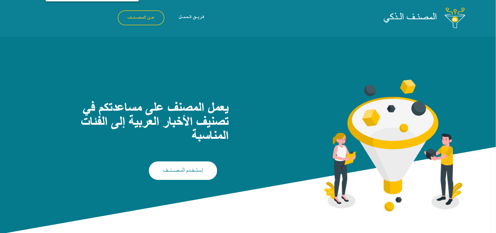
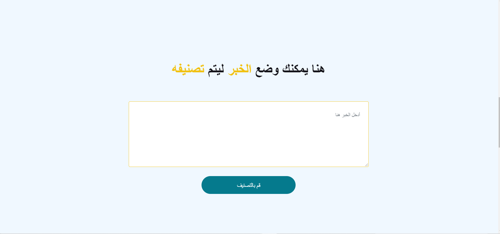

# Smart Arabic News Classifier 

---
CONTENTS OF THIS FILE
---------------------

 * Introduction
 * Requirements
 * Installation
 * Configuration
 * Demo URL
 * Developers

 INTRODUCTION
 ------------

 Large amounts of data are collected everyday. As more information becomes available, it becomes difficult to reach what we are looking for. So there is a need for tools and techniques to organize, search and understand vast quantities of information.

 Our project aim to classify the Arabic news, by using the news that collected from Al Arabiya news in [mendeley website](https://data.mendeley.com/datasets/57zpx667y9/2), with classification model, So it can help in organizing, understanding and summarizing large collections of textual information.

 REQUIREMENTS
------------

This module requires the following modules:
* Technologies :
  * [Python](https://www.python.org/)
  * [HTML](https://developer.mozilla.org/en-US/docs/Web/HTML)
  * [CSS](https://developer.mozilla.org/en-US/docs/Web/CSS)
  * [JavaScript](https://developer.mozilla.org/en-US/docs/Web/JavaScript)
  * [JQuery](https://jquery.com/)
  * [Bootstrap](https://getbootstrap.com/docs/4.1/getting-started/introduction/)
  * [Flask](https://flask.palletsprojects.com/en/1.1.x/)

* Libraries :
  * [pandas](https://pandas.pydata.org/docs/)
  * [NLTK](https://www.nltk.org/)
  * [regex](https://docs.python.org/3/library/re.html)
  * [sklearn](https://scikit-learn.org/stable/)
  * [pickle](https://docs.python.org/3/library/pickle.html)

  INSTALLATION
------------

* Install pandas : `pip install pandas`
* Install NLTK : `pip install nltk`
* Install regex : `pip install regex`
* Install scikit-learn : `pip install scikit-learn`
* Install pickle : `pip install pikl`

CONFIGURATION
-------------
 * Open anaconda prompt
 * Access SANC directory
 * Write `python app.py`

DEMO URL
------------

 
 

 
 

[Demo]()

DEVELOPERS
-----------

 * Kholoud Khalid Owais

 * Reem Moteb Alruqi

 * Waad Mohammed Alotiabi

This project has been introduced as a requirement for a data science immersive internship provided by :
 * General Assembly :
   is a private, for-profit educational institution, which is an educational institution with business and practical technical skills.
   Visit https://generalassemb.ly/why-ga-is-worth-it for more information.
 * Misk Academy :
   A non-profit institution in the Kingdom of Saudi Arabia, established by Prince Muhammad bin Salman bin Abdulaziz, provides education to the community in all fields, including literary, cultural, social and technological sciences, and business fields.
   Visit https://www.miskacademy.edu.sa/ for more information.
